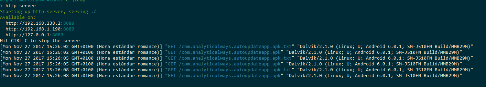

Prueba de concepto para auto actualizar una app.

1. Tanto la apk firmada como un fichero de texto deben estar disponibles en un servidor remoto.
    * com.analyticalways.autoupdateapp.apk
    * com.analyticalways.autoupdateapp.apk.txt
2. En el terminal debemos autorizar a las aplicaciones de fuentes/ orígenes desconocidos.

